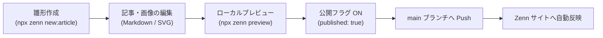

# zenn

技術情報共有プラットフォーム [Zenn](https://zenn.dev/shin4488) の記事コンテンツを管理するリポジトリです。  
`main` ブランチへのプッシュにより、Zenn の GitHub 連携機能を通じて記事が自動的に同期・公開されます。

---

## 執筆・公開フロー



---

## 開発・執筆環境

### 1. セットアップ

```bash
npm install
```

### 2. よく使うコマンド

```bash
# 新しい記事のテンプレート作成（articles/ ディレクトリに生成）
npx zenn new:article

# ローカルプレビューサーバの起動（http://localhost:8000 で確認）
npx zenn preview
```

---

## 記事作成のガイドライン

- **記事ファイル**: `articles/<スラッグ>.md` に配置します（スラッグは半角英数字とハイフンで指定）。
- **フロントマター**: 記事冒頭にタイトル、絵文字、トピック、公開ステータスを設定します。
  ```markdown
  ---
  title: "記事のタイトル"
  emoji: "🚀"
  type: "tech" # tech: 技術記事 / idea: アイデア
  topics: ["react", "typescript"]
  published: false # true で本番公開
  ---
  ```
- **画像の管理**: 記事ごとに `images/<スラッグ>/` ディレクトリを作成して配置し、本文からは `/images/<スラッグ>/example.png` の形式で参照します。
- **図解・ベクター画像**: `assets/svg/<スラッグ>/` に元データ（SVG）を管理し、PNG等に書き出して記事に埋め込みます。

---

## ディレクトリ構成

```text
zenn/
├── articles/        # 記事 Markdown ファイル
├── images/          # 記事用画像アセット（スラッグごとのサブディレクトリ）
├── assets/          # 作図元ファイル（SVG 等、デプロイ対象外）
└── books/           # Zenn Book 管理用ディレクトリ
```
