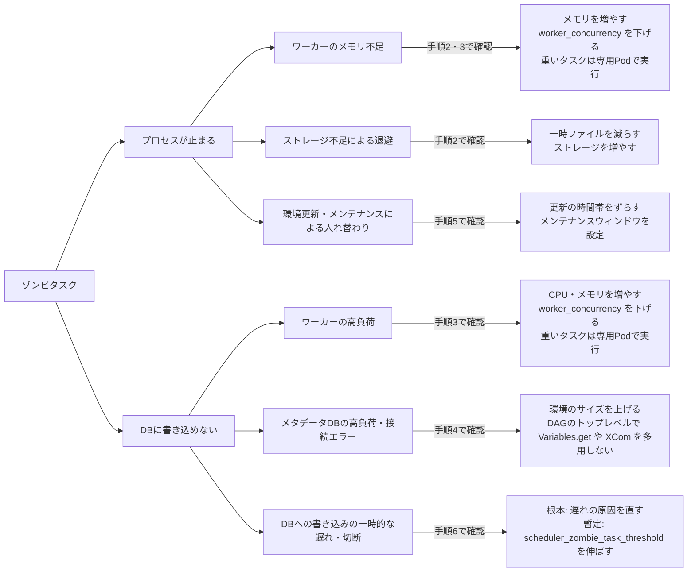

Airflowを運用していると、Schedulerのログに `Detected zombie job` と記録され、動いていたはずのタスクがゾンビタスクとして失敗することがあります。このログは「Airflowがタスクの動作を確認できなくなった」という結果を伝えるだけで、原因までは書かれていません。原因は、ワーカーのメトリクスやほかのログと突き合わせて絞り込む必要があります。

この記事では、ゾンビタスクが検出される仕組みを説明したあと、発生の確認、原因の切り分け、対処の手順をまとめます。コマンド例はGoogle CloudのマネージドAirflow向けですが、考え方は自前のAirflowでも同じです。対象はAirflow 2系で、Airflow 3での変更点は最後にまとめます。

## ゾンビタスクが検出される仕組み

先に、Airflowがどんな条件でタスクをゾンビと判定するのかを見ておきます。原因を探すときは、この条件に当てはまる状況を順に確かめていくことになります。

登場するのは次の3つです。

| 登場するもの | 役割 |
|---|---|
| ワーカー | タスクを実行する |
| メタデータDB | タスクの状態を保存する |
| Scheduler | DAGの実行タイミングを決めて、タスクをワーカーに割り当てる。<br>ゾンビタスクの検出も担当する |

ワーカーでタスクを実行しているプロセスは、既定では5秒おきにメタデータDBの「最終更新時刻」を現在時刻に書き換えます。これが「まだ動いている」という合図で、心拍のように一定間隔で打ち続けることから**ハートビート**と呼ばれます。以降はこの合図をハートビートと書きます。


*① ワーカーは5秒おきに現在時刻をDBに書き込む。② その時刻がタスクの最終更新時刻として残る。③ Schedulerはワーカーを直接見ず、この時刻を読んで、最近更新されていれば動いていると判断する*

Schedulerはワーカーを直接監視しているわけではなく、DBに残った最終更新時刻だけを見ています。定期的にDBを確認し、状態が `running` のタスクのうち、次のどちらかに当てはまるものをゾンビと判定します（公式ドキュメント: [Zombie/Undead Tasks](https://airflow.apache.org/docs/apache-airflow/2.10.5/core-concepts/tasks.html#zombie-undead-tasks)）。

- タスクを実行しているジョブが `running` ではなくなっている
- 最終更新時刻から一定時間（既定で300秒）が過ぎている

ゾンビ判定されたタスクは失敗になります。再試行の設定があれば再試行されます。


*上:ハートビートが止まっても、DBの状態は running のまま最終更新時刻だけが古くなる。Schedulerは「今」との差が300秒を超えたのを見てゾンビと判定し、failed にする。下:同じ流れを時間軸で見たもの*

ゾンビ判定に関係する設定は、設定ファイル `airflow.cfg` の `[scheduler]` セクションにあります。現在の値はAirflow画面の Admin → Configurations で確認でき（管理者が非表示にしている環境もあります）、Google CloudのマネージドAirflowでは環境の設定画面の「Airflow構成のオーバーライド」で変更できます。関係するのは次の3つです。

| 設定 | 既定値 | 意味 |
|---|---|---|
| `job_heartbeat_sec` | 5秒 | ハートビートを打つ間隔（最終更新時刻を書き換える間隔） |
| `scheduler_zombie_task_threshold` | 300秒 | 最終更新時刻からこの時間が過ぎたらゾンビとみなす |
| `zombie_detection_interval` | 10秒 | Schedulerがゾンビを探す間隔 |

ゾンビタスクは原因の名前ではなく、「ハートビートが途絶えた（最終更新時刻が書き換えられなくなった）」という結果です。途絶えた理由は複数考えられ、`Detected zombie job` のログにはどれなのか書かれていません。

## 発生を確認する

Google Cloudでは、Schedulerのログを `Detected zombie job` で検索します（[公式のトラブルシューティング](https://docs.cloud.google.com/composer/docs/composer-3/troubleshooting-dags#zombie-tasks)）。

```shell
gcloud logging read 'resource.type="cloud_composer_environment"
AND resource.labels.environment_name="YOUR_COMPOSER_ENVIRONMENT"
AND log_id("airflow-scheduler")
AND textPayload:"Detected zombie job"
AND timestamp>="2026-08-01T00:00:00Z"
AND timestamp<="2026-08-01T12:00:00Z"' \
  --project=YOUR_PROJECT_ID \
  --order=asc \
  --limit=1000 \
  --format='value(timestamp,textPayload)'
```

ログ本文の `msg` に、どのタスクがどのワーカーで動いていたかがそのまま書かれています。

```text
Detected zombie job: {'full_filepath': '/home/airflow/gcs/dags/sample_dag.py', ..., 'msg': "{'DAG Id': 'sample_dag', 'Task Id': 'load', 'Run Id': 'scheduled__2026-08-01T00:00:00+00:00', 'Hostname': 'airflow-worker-xxxxx'}", ...} (See https://airflow.apache.org/docs/apache-airflow/stable/core-concepts/tasks.html#zombie-undead-tasks)
```

調査に使うのは次の4つです。件数が多いときは、ログの時刻とこの4つを表計算ソフトなどに書き出しておくと、あとの手順で見比べやすくなります。

| 項目 | 使いみち |
|---|---|
| ログの時刻 | メトリクスやほかのログと同じ時間帯で突き合わせる |
| DAG Id・Task Id | 影響した処理を特定する |
| Run Id | 同じDAGの別の実行と区別する |
| Hostname | 実行していたワーカー。複数のタスクが同じワーカーに集中していないかを見る |

ログが1件も見つからないときは、「発生していない」か「ログの保持期間を過ぎている」可能性があります。保持日数は次のコマンドで確認できます。

```shell
gcloud logging buckets describe _Default \
  --location=global \
  --project=YOUR_PROJECT_ID \
  --format='value(retentionDays)'
```

期間全体の傾向を見たいときは、ゾンビとして停止したタスク数のメトリクス `composer.googleapis.com/environment/zombie_task_killed_count` を使ってMetrics Explorerで表示できます（メトリクス一覧: [公式の監視ドキュメント](https://docs.cloud.google.com/composer/docs/composer-3/monitor-environments)）。

## ハートビートが途絶える原因


*上:書き込みが続くので最終更新時刻が更新され、正常と判断される。中:プロセスが止まって書き込みも止まる。下:プロセスは動いているがDBに書き込めない。中と下はどちらも最終更新時刻が古いままになり、ゾンビと判定される*

ハートビートが途絶える経路は大きく2つあります。プロセスが止まった場合と、プロセスは動いているのに現在時刻をDBに書き込めない場合です。原因候補を経路ごとに整理すると次のようになります。

| 経路 | 原因 | 主な手がかり |
|---|---|---|
| プロセスが止まる | メモリ不足による強制終了 | ワーカーログの `Negsignal.SIGKILL`、メモリ使用率 |
| プロセスが止まる | ワーカーの再起動 | ワーカーの再起動回数 |
| プロセスが止まる | ワーカーの退避・縮小・環境更新・メンテナンス | Podの退避回数、ワーカー数の推移、監査ログ、メンテナンスのメトリクス |
| DBに書き込めない | ワーカーの高負荷 | CPU・メモリ使用率、同時実行数 |
| DBに書き込めない | メタデータDBの高負荷・停止 | DBの正常性、CPU・メモリ使用率 |
| DBに書き込めない | ネットワーク障害 | 接続エラー、ワーカーログの `Heartbeat time limit exceeded` |
| DBに書き込めない（一時的） | 一時的な遅れに対して判定までの時間が短い | 回復しているのに繰り返しゾンビになる。ワーカーログに `Heartbeat time limit exceeded` が繰り返し出る |

Google Cloudの[公式ドキュメント](https://docs.cloud.google.com/composer/docs/composer-3/monitor-key-metrics)では、最も多い原因はワーカーのCPU・メモリ不足とされています。そのため、次の手順もワーカーから見ていきます。

## 原因を切り分けて対処する

原因候補が複数あるので、検出時刻の前後10〜15分に絞って、ワーカー → メタデータDB → 環境の変更 → 通信の順に確認します。

下の図は、この切り分けを1件のゾンビタスクに当てはめた例です。以降の手順で集める情報を、ゾンビ検出の時刻を軸に同じ時間軸へ並べると、どの出来事が検出と重なっているかが見えてきます。


*切り分けの例。ワーカーの再起動とメモリの上昇が検出直前に重なり、DBは正常、環境の変更は時間帯の外にある。この場合はワーカー側を疑う。各行の情報の集め方は手順2〜5で説明する*

以降のコマンドの `YOUR_PROJECT_ID`、`YOUR_COMPOSER_ENVIRONMENT`、`YOUR_WORKER_NAME` は調査対象に置き換えてください。

各手順の表にある `composer.googleapis.com/...` は、Cloud Monitoringのメトリクス名です。Google Cloudコンソールの Monitoring → Metrics Explorer（`https://console.cloud.google.com/monitoring/metrics-explorer?project=YOUR_PROJECT_ID`）を開き、「指標を選択」の検索欄にこの名前を貼り付けるとグラフが表示されます。名前の先頭で対象が分かれます。

| 名前の先頭 | 対象（Metrics Explorerで選ぶリソースの種類） | 絞り込み |
|---|---|---|
| `environment/` | 環境全体の値（Cloud Composer Environment） | `environment_name` |
| `workload/` | ワーカーなど個々の実体ごとの値（Cloud Composer Workload） | `environment_name` と `workload_name`（ワーカー名） |
| `workflow/` | DAG・タスクごとの値（Cloud Composer Workflow） | `workflow_name`（DAG名）と `task_id` |

### 1. 発生時刻・ワーカー・タスクの傾向を見る

最初に、[発生を確認する](#発生を確認する)で取得したログを、時刻・Hostname・DAG Id・Task Idで並べて見比べます。


*ログを時刻・Hostname・DAG Id・Task Idで並べると傾向が見える。傾向によって、次に調べる対象が変わる。傾向は原因を確定する証拠ではなく、調査の順番を決める手がかり*

傾向によって、次に調べる対象が変わります。ただし、傾向だけで原因は確定できません。同じワーカーに集中していても、再起動やリソース不足の記録がなければ別の原因の可能性があります。

| ログの傾向 | 次に調べる対象 | 手順 |
|---|---|---|
| 同じワーカー・近い時刻に集中 | そのワーカーの再起動やリソース不足 | [手順2](#2.-ワーカーの再起動・退避)・[手順3](#3.-ワーカーのメモリ・cpu) |
| 複数のワーカー・近い時刻に集中 | DB、ネットワーク、環境更新などの共通要因 | [手順4](#4.-メタデータdb)〜[手順6](#6.-通信エラーと設定値) |
| 同じDAG・Taskで繰り返す | タスク固有のCPU・メモリ消費や処理内容 | [手順3](#3.-ワーカーのメモリ・cpu)のタスクごとの使用率<br>[手順2](#2.-ワーカーの再起動・退避)のワーカーログ |

### 2. ワーカーの再起動・退避

| 確認対象 | 見る場所 | メトリクス・ログ |
|---|---|---|
| ワーカーごとの再起動回数 | Metrics Explorer | `composer.googleapis.com/workload/restart_count` |
| 環境全体のワーカーPod退避回数 | Metrics Explorer | `composer.googleapis.com/environment/worker/pod_eviction_count` |
| ワーカーごとのストレージ使用量・上限 | Metrics Explorer | `composer.googleapis.com/workload/disk/bytes_used`、`composer.googleapis.com/workload/disk/quota` |
| 強制終了・停止の記録 | ワーカーログ（下のコマンド） | `Negsignal.SIGKILL`、`Received SIGTERM` |

メトリクスは、`Detected zombie job` のログの Hostname にあたるワーカーを `workload_name` で指定して見ます。退避回数だけは環境全体の値なので、退避があった時刻をワーカーログと照合してワーカーを特定します。そのワーカーのストレージ使用量が上限近くなら、退避の原因はストレージ不足と考えられます。

ワーカーログは次のコマンドで検索します（`Negsignal.SIGKILL` と `Received SIGTERM` の意味は[公式のトラブルシューティング](https://docs.cloud.google.com/composer/docs/composer-3/troubleshooting-dags#sigterm)を参照）。手順6で使う `Heartbeat time limit exceeded` も一緒に探します。出力の `labels` で、どのDAG・タスクのログかが分かります。

```shell
gcloud logging read 'resource.type="cloud_composer_environment"
AND resource.labels.environment_name="YOUR_COMPOSER_ENVIRONMENT"
AND log_id("airflow-worker")
AND (textPayload:"Negsignal.SIGKILL"
     OR textPayload:"Received SIGTERM"
     OR textPayload:"Heartbeat time limit exceeded")
AND timestamp>="2026-08-01T00:00:00Z"
AND timestamp<="2026-08-01T12:00:00Z"' \
  --project=YOUR_PROJECT_ID \
  --order=asc \
  --limit=1000 \
  --format='value(timestamp,labels,textPayload)'
```

検出の直前に同じワーカーの再起動や退避があれば、その再起動・退避でタスクのプロセスが失われたと判断できます。再起動の理由は回数からは分からないので、次のメモリ・CPUで確かめます。

状況に応じた対処です（各手順の対処は[公式のトラブルシューティング](https://docs.cloud.google.com/composer/docs/composer-3/troubleshooting-dags#zombie-tasks)に基づいています）。

| 状況 | 対処 |
|---|---|
| ストレージ不足で退避されていた（退避の時刻に、そのワーカーのストレージ使用量が上限近い） | 一時ファイルを早めに消す。<br>大きなファイルをワーカーに置かない。<br>ワーカーのストレージを増やす |
| 再起動・退避していたが、ストレージには余裕があった | 理由は回数からは分からない。<br>メモリ不足なら[手順3](#3.-ワーカーのメモリ・cpu)、環境更新・メンテナンスなら[手順5](#5.-環境の変更・メンテナンス)で確かめて対処する |

### 3. ワーカーのメモリ・CPU

| 対象 | 確認対象 | 見る場所 | メトリクス・設定 |
|---|---|---|---|
| ワーカー全体 | メモリ使用量 | Metrics Explorer | `composer.googleapis.com/workload/memory/bytes_used` |
| ワーカー全体 | メモリ上限 | Metrics Explorer | `composer.googleapis.com/workload/memory/quota` |
| ワーカー全体 | CPU使用時間 | Metrics Explorer | `composer.googleapis.com/workload/cpu/usage_time` |
| タスクごと | CPU使用率 | Metrics Explorer | `composer.googleapis.com/workflow/task/cpu_usage` |
| タスクごと | メモリ使用率 | Metrics Explorer | `composer.googleapis.com/workflow/task/mem_usage` |
| 設定 | 1台のワーカーが同時に実行するタスク数の上限 | Airflow画面の Admin → Configurations | `[celery] worker_concurrency` |

ワーカー全体のメモリは、使用量そのものではなく上限に対する割合で見ます。上の2つのメトリクスから割合を出すには、Metrics Explorerのクエリ言語に **PromQL** を選び、次のクエリを実行します（参考: [PromQLでの書き方](https://docs.cloud.google.com/monitoring/promql/promql-mapping)）。使用率（%）がそのまま表示されます。

```promql
100 *
composer_googleapis_com:workload_memory_bytes_used{
  monitored_resource="cloud_composer_workload",
  environment_name="YOUR_COMPOSER_ENVIRONMENT",
  workload_name="YOUR_WORKER_NAME"
}
/
composer_googleapis_com:workload_memory_quota{
  monitored_resource="cloud_composer_workload",
  environment_name="YOUR_COMPOSER_ENVIRONMENT",
  workload_name="YOUR_WORKER_NAME"
}
```

見るときのポイントは3つです。

| ポイント | 理由 |
|---|---|
| ゾンビになったタスクを実行していたワーカー（ログの Hostname）だけを指定する | 全ワーカーの合計だと、1台の逼迫が薄まって見えない |
| 検出前後の最大値を見る | メトリクスは60秒間隔なので、短時間の急上昇を取りこぼす |
| 80%超が続き、同じ時間帯に再起動や `Negsignal.SIGKILL` があれば、メモリ不足を有力な候補とする | 使用率だけでは、強制終了されたかどうかは分からない |

タスクごとのCPU・メモリ使用率は最初から割合（%）なので、そのまま見られます。同じ時間帯に動いていたタスクのうち、どれが多く使っていたかを比べるのに使います。

状況に応じた対処です。

| 状況 | 対処 |
|---|---|
| ワーカー全体のメモリ・CPUが上限近く（80%超）まで使われていた | ワーカーのメモリ・CPUを増やす。<br>同時に実行するタスク数の上限 `worker_concurrency` を下げる※ |
| 特定のタスクだけ使用量が大きい | タスクの処理を見直して使用量を減らす。<br>KubernetesPodOperator でワーカーの外の専用Podで実行する（CPU・メモリを個別に指定できる） |

※ `worker_concurrency` は、1台のワーカーが同時に実行するタスク数の上限です。設定で決めた上限にすぎず、その数のタスクを同時に動かしてもワーカーのメモリ・CPUが足りるとは限りません。下げると同時に動くタスクが減り、ワーカー全体のメモリ・CPU使用量のピークが下がります。いくつまで下げるかは、そのワーカーで同時に動いていたタスク数と1タスクあたりの使用量から決めます。

### 4. メタデータDB

ワーカー側に異常が見つからなければ、ハートビートの書き込み先であるDBを疑います。

| 確認対象 | メトリクス（Metrics Explorerで見る） |
|---|---|
| 正常性 | `composer.googleapis.com/environment/database_health` |
| CPU使用率 | `composer.googleapis.com/environment/database/cpu/utilization` |
| メモリ使用率 | `composer.googleapis.com/environment/database/memory/utilization` |

`database_health` は、監視用のPodが1分ごとにDBへ接続できたかを表す値なので、正常でも短い遅延や一部の接続失敗までは否定できません。CPU・メモリ使用率と接続エラーも合わせて見て、どれにも異常がなければDBが原因である可能性は下がります。

状況に応じた対処です。

| 状況 | 対処 |
|---|---|
| DBのCPU・メモリが高い | 環境のサイズを上げる（DBの性能も上がる）。<br>Schedulerの台数やDAG解析の頻度を下げる |
| DAGのコードがDBに負荷をかけている | トップレベルのコード（DAGファイルの解析のたびに実行される部分）で `Variables.get` や XCom を多用しない（Jinjaテンプレートで参照する）。<br>`CloudLoggingHandler` を使わない |

### 5. 環境の変更・メンテナンス

環境の更新やパッケージのインストール中はワーカーが入れ替わります。実行中のタスクが猶予時間内に終わらないと中断され、ゾンビとして検出されます。ワーカーが入れ替わる操作は、バージョン更新、PyPIパッケージの変更、Airflow構成のオーバーライドや環境変数の変更、ワーカーのCPU・メモリ・ストレージの変更などです（[公式ドキュメント](https://docs.cloud.google.com/composer/docs/composer-3/update-environments#updates-restart)）。

| 確認対象 | 見る場所 | メトリクス・ログ |
|---|---|---|
| 環境の更新・パッケージの変更 | 監査ログ（下のコマンド） | `cloudaudit.googleapis.com/activity` |
| メンテナンスの実施 | Metrics Explorer | `composer.googleapis.com/environment/maintenance_operation` |
| 自動スケールによるワーカー数の増減 | Metrics Explorer | `composer.googleapis.com/environment/num_celery_workers` |

監査ログは次のコマンドで検索します。`log_id` の引数はURLエンコードせずに書きます（エンコードすると一致しなくなることが[クエリ言語の仕様](https://docs.cloud.google.com/logging/docs/view/logging-query-language#log_id)に書かれています）。

```shell
gcloud logging read 'resource.type="cloud_composer_environment"
AND resource.labels.environment_name="YOUR_COMPOSER_ENVIRONMENT"
AND log_id("cloudaudit.googleapis.com/activity")
AND timestamp>="2026-08-01T00:00:00Z"
AND timestamp<="2026-08-01T12:00:00Z"' \
  --project=YOUR_PROJECT_ID \
  --order=asc \
  --limit=1000 \
  --format='value(timestamp,protoPayload.methodName)'
```

状況に応じた対処です。

| 状況 | 対処 |
|---|---|
| 環境更新中にワーカーが入れ替わった | 重要なタスクが動いていない時間帯に更新する。<br>タスクに再試行（`retries`）を設定する |
| メンテナンス中だった | メンテナンスウィンドウを設定して、重要なタスクの時間帯と重ならないようにする |

### 6. 通信エラーと設定値

ワーカーがDBに書き込めない状態が判定までの時間を超えると、ワーカー側のログにも `Heartbeat time limit exceeded` が残ります。手順2の検索でこれが見つかっていれば、ワーカーとDBの間の通信か、DB側の応答の遅れを疑います。DBが正常なら、ネットワークの接続エラーやタイムアウトを同じ時間帯のログから探します。

状況に応じた対処です。

| 状況 | 対処 |
|---|---|
| DBへの書き込みが一時的に遅れたり接続が切れたりしただけで、待てば回復していた | 根本的な対処: 遅れの原因を直す。DBの負荷なら[手順4](#4.-メタデータdb)、ワーカーの負荷なら[手順3](#3.-ワーカーのメモリ・cpu)の対処。<br>暫定的な対処: `scheduler_zombie_task_threshold` を伸ばして一時的な遅れを許容する（伸ばした分だけ、本当に止まったタスクの検出も遅れる）。タスクに再試行（`retries`）を設定する |

## ゾンビタスクの原因と対処のまとめ



ログが見つからないときは、調査期間がログの保持期間内か（[発生を確認する](#発生を確認する)）と、Podの退避でログが失われていないか（[手順2](#2.-ワーカーの再起動・退避)の退避回数）も確かめます。環境更新、メンテナンス、一時的な接続障害のように時間がたてば解消する原因には、タスクの再試行（`retries`）が有効です。ゾンビタスクが自動で再実行され、原因が解消していれば成功します。

## Airflow 3 での変更点

Airflow 3では「ゾンビ」という呼び方がなくなり、「ハートビートのないタスクインスタンス」と表現されるようになりました（[公式ドキュメント](https://airflow.apache.org/docs/apache-airflow/stable/core-concepts/tasks.html#task-instance-heartbeat-timeout)）。仕組みは同じですが、ログの文言と設定名が変わっているため、検索条件は読み替えてください。Google CloudのマネージドAirflowでもAirflow 3のイメージが選べます。

| Airflow 2 | Airflow 3 |
|---|---|
| ログ `Detected zombie job` | ログ `Detected a task instance without a heartbeat` |
| `scheduler_zombie_task_threshold` | `task_instance_heartbeat_timeout` |
| `zombie_detection_interval` | `task_instance_heartbeat_timeout_detection_interval` |
