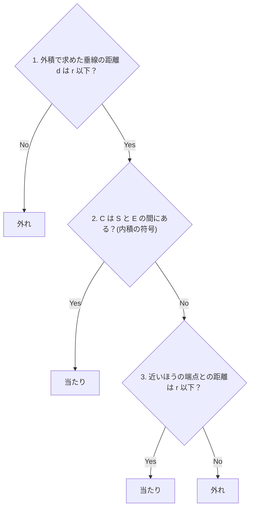

ゲームを作っていると、線分と円の当たり判定が欲しくなる場面がちょくちょくあります。レーザーが敵に当たったかどうかはまさにそうですし、振った剣が敵に当たったかどうかも同様に判定できます。ブロック崩しでボールがパドルで跳ね返るのも、ボールを円・パドルを線分と見立てれば同じ判定ができます。

円同士の当たり判定は、中心間の距離を半径の和と比べるだけで書けます。実は線分と円の当たり判定もやることはほぼ同じです。「円の中心から線分までの最短距離を測って、半径と比べる」。これがゴールです。


*どちらも「距離」と「半径」を比べるだけ。違いは距離の測り方*

この最短距離を測る際に出てくるのが三角関数です。この記事では、前半で理論を学んでから、後半で TypeScript を使って実装します。

## 三角関数のおさらい

円の中心から線分までの最短距離は、sinθ を使って測ります。その準備として、sin と cos の意味を軽くおさらいしましょう。

長さ L の棒を、地面との角度が θ になるように斜めに立てたとします(下の図の左側)。このとき、棒の「横の長さ」(横方向にどれだけ伸びているか)は $L \times \cos\theta$ になります。数式では掛け算の記号を省略して $L\cos\theta$ と書くので、この記事でも以降はそう書きます。同じように、高さは $L\sin\theta$ です。棒を寝かせるほど横に伸びて、立てるほど縦に伸びます。つまり、

- 斜めの長さ × cosθ =「横」の長さ
- 斜めの長さ × sinθ =「縦」の長さ

この記事で使うのはほぼこれだけです。


*左:長さ L の棒の横の長さは $L\cos\theta$、縦の長さは $L\sin\theta$。右:90° を超えると横はマイナスになる*

もうひとつ、右側の図も見てください。θ が 90° を超えると上端が下端より後ろに回り込むので、横の長さ $L\cos\theta$ はマイナスになります。つまり **cosθ の符号を見れば、上端が「前」にあるか「後ろ」にあるかがわかります**。こちらは後半、円が線分の端からはみ出した位置にあるかを見分けるところで使います。

## 内積と外積

高さ $L\sin\theta$ で距離が測れるといっても、ゲームが持っている座標データは点の位置だけで、角度 θ はどこにも記録されていません。`Math.atan2` で θ を求める手もありますが、実はその必要すらありません。座標の掛け算と足し算だけで、cosθ・sinθ の掛かった値を直接取り出す方法があるからです。それがベクトルの内積と外積です。

計算はベクトル(ある点から別の点へ向かう矢印)で進めます。まず下の図のように、2本のベクトル A と B の始点を揃えて並べて、なす角(矢印の間の角度)を θ とします。A を地面に、B を「θ だけ傾けて立てた長さ $|B|$ の棒」に見立てると、さっきの話の通り、B の横の長さは $|B|\cos\theta$、高さは $|B|\sin\theta$ です。


*A を地面、B を傾けて立てた棒と見ると、横の長さが $|B|\cos\theta$、高さが $|B|\sin\theta$*

内積と外積は、この2つの長さとつながっています。A の長さを $|A|$ と書くと、

$$\text{内積:}\ A \cdot B = |A||B|\cos\theta \qquad \text{外積:}\ A \times B = |A||B|\sin\theta$$

が成り立ちます。内積からは B の「横の長さ」が、外積からは B の「高さ」がわかるということです($|A|$ 倍が付いていますが、$|A|$ で割れば長さそのものが出ます※)。左辺の内積・外積を座標から計算する式は、実装の節で出てきます。掛け算と足し算だけの単純な式なので、座標さえあれば角度を経由せずにこの2つの長さが手に入ります。

※ B が A の下側にあるとマイナスの値になるので、高さを距離として使うときは絶対値を取ります。

あとは A と B に何を当てはめるかです。イメージだけ先に言うと、A を線分に、B を「線分の始点から円の中心への矢印」にすると、B の「高さ」がそのまま円までの距離になります。つまり外積で円までの距離が測れて、内積で円がどのあたりにあるかを見分けられます。詳しくは次節以降で見ていきましょう。

## 円の中心から「直線」までの距離は外積でわかる

この節では、ゴールである「最短距離」を測ります。線分の始点を S、終点を E、円の中心を C、半径を r とします。

いきなり線分を考えるのは難しいので、まずは S と E を通る「直線」(両側に無限に伸びた線)で考えます。円は中心から距離 r 以内の範囲のことなので、C から直線までの最短距離 d を測れば、d ≤ r かどうかで直線と円が重なっているかが決まります。最短距離は、C から直線へ垂直に下ろした線(垂線)の長さです。


*$d = |SC|\sin\theta$:円の中心から「直線」までの距離*

この d を、前の節の A と B に当てはめて測ります。A にあたるのが線分方向のベクトル SE、B にあたるのが始点 S から円の中心 C へ引いたベクトル SC です。図のように、SE を地面、SC をその上に傾けて立てた棒と見ると、棒の高さがちょうど d になっています。つまり $d = |SC|\sin\theta$ です。

そして高さは、外積から取り出せるのでした。

$$|SE \times SC| = |SE||SC|\sin\theta$$

右辺をよく見ると、欲しい $|SC|\sin\theta$ に $|SE|$ が余分に掛かっています。両辺を $|SE|$ で割れば、

$$d = |SC|\sin\theta = \frac{|SE \times SC|}{|SE|}$$

となって、座標から計算できる外積と長さだけで d が求まります。  
※ なお SE と SC そのものは座標の引き算で作れます。E の座標から S の座標を引けば SE、C の座標から S の座標を引けば SC です。詳しくは実装の節で解説します。

d > r なら、無限に伸びる直線ですら円に届いていないのだから、その一部でしかない線分も当たっていません。ここで大半のケースをふるい落とせます。

## 線分には端がある

では d ≤ r なら当たりかというと、そうとは限りません。下の図がその例です。直線は円と重なっていますが(d ≤ r)、線分は円に届いていません。


*延長線上では重なっていても、線分そのものは届いていない*

直線は無限に伸びていますが、線分には両端があります。図のように、延長線上では円と重なっていても、線分自体は届いていないケースがあります。直線と円の最短距離の判定(d ≤ r)だけで実装を終えると、画面の端で撃った弾がはるか遠くの敵に当たる、というバグが起きます。

そこで、円の中心が S と E の間にあるのか、端からはみ出した外側にあるのかを区別する必要があります。

## 円の中心がどこにあるかは内積でわかる

ここで、最初におさらいした「90° を超えると cosθ はマイナス」を使います。

内積 $SE \cdot SC = |SE||SC|\cos\theta$ のうち、長さの部分は必ず 0 以上です。だから内積の符号は cosθ の符号と同じです。SE・SC がマイナスなら、S から見て C は E と反対側、つまり始点の外側にあります。終点側も同じ考え方で、ES・EC がマイナスなら C は終点 E の外側にあります。


*円の中心がどの領域にあるかは、内積の符号(cosθ の正負)でわかる*

- SE・SC < 0 → C は始点 S の外側
- ES・EC < 0 → C は終点 E の外側
- どちらも 0 以上 → C は S と E の間(図の中央の領域)

S と E の間にあるなら垂線はちゃんと線分の上に下りるので、d ≤ r がそのまま結論になります。外側にある場合は、線分の中で C に一番近い点は端点そのものなので、端点と C の距離を r と比べれば判定できます。

考え方はこれで全部です。判定の流れをまとめると、こうなります。



## 実装

ここからは上の 1〜3 をコードにします。まずベクトルまわりの関数から。

```ts
// 2Dベクトル。ただの x, y のペア
type Vec = { x: number; y: number };

// ベクトルを作る
const vec = (x: number, y: number): Vec => ({ x, y });

// a から b へ向かうベクトル(b - a)
const sub = (b: Vec, a: Vec): Vec => vec(b.x - a.x, b.y - a.y);

// ベクトルの長さ(三平方の定理)
const len = (v: Vec): number => Math.hypot(v.x, v.y);

// 内積:|a||b|cosθ に一致する
const dot = (a: Vec, b: Vec): number => a.x * b.x + a.y * b.y;

// 外積:|a||b|sinθ に一致する(2Dでは数値が1つ返る)
const cross = (a: Vec, b: Vec): number => a.x * b.y - a.y * b.x;
```

内積も外積も、実装はこの掛け算と足し算だけです。なお長さの関数を `length` にしなかったのは、トップレベルに書くと DOM の型定義にある `window.length` と衝突してコンパイルエラーになるためです。

判定本体は、理論の 1〜3 をそのまま並べます。

```ts
// s, e: 線分の始点・終点  c: 円の中心  r: 半径
function isHitSegmentCircle(s: Vec, e: Vec, c: Vec, r: number): boolean {
  const se = sub(e, s); // 線分ベクトル
  const sc = sub(c, s); // 始点から円の中心へ

  // 1. 垂線の距離 d = |SE × SC| / |SE|。直線にも届かないなら外れ
  // 外積は円の中心が線のどちら側にあるかで符号が変わるので、Math.abs で絶対値を取って距離にする
  const d = Math.abs(cross(se, sc)) / len(se);
  if (d > r) return false;

  // 2. 円の中心が S と E の間にあるなら、d ≤ r なので当たり
  const es = sub(s, e); // 終点から始点へ
  const ec = sub(c, e); // 終点から円の中心へ
  if (dot(se, sc) >= 0 && dot(es, ec) >= 0) return true;

  // 3. 外側にあるなら、近いほうの端点との距離で判定
  return len(sc) <= r || len(ec) <= r;
}
```

## 動作確認

横一直線の線分 S(0, 0)-E(100, 0) に、位置と半径を変えた3つの円をぶつけてみます。

```ts
const s = vec(0, 0);
const e = vec(100, 0);

// ケース1:円の中心が S と E の間、線分から距離30の位置にある半径40の円
console.log(isHitSegmentCircle(s, e, vec(50, 30), 40));  // true

// ケース2:円の中心が延長線上、端点Eから50離れた位置にある半径40の円
console.log(isHitSegmentCircle(s, e, vec(150, 0), 40));  // false

// ケース3:ケース2と同じ位置で、半径だけ60に広げた円
console.log(isHitSegmentCircle(s, e, vec(150, 0), 60));  // true
```

それぞれの配置と、判定の根拠を図にするとこうなります。


*ケース2と3は円の位置が同じで、半径だけが違う*

ケース1は円の中心が S と E の間にあるので、垂線の距離 d = 30 と半径 40 の比較になり、当たりです。

ポイントはケース2です。円の中心が延長線上にあるので d = 0 ですが、**内積の符号で円の中心が「終点 E の外側」に分類されるため、r と比べる距離は端点との距離 |EC| = 50 になります。半径 40 では届かず、外れです**。d ≤ r のチェックだけの実装だと、ここで誤って当たりにしてしまいます。ケース3は同じ位置でも半径が 60 に伸びた分だけ端点に届くので、当たりになります。

## 注意点

線分の長さが 0 だと `len(se)` が 0 になり、d の計算が 0 除算になります。TypeScript の 0 除算は例外にならず Infinity や NaN が返るだけで、ここでは d が NaN になります。NaN との比較はすべて false なので `if (d > r)` を素通りし、内積も両方 0 になるため、円がどこにあっても「当たり」と判定されてしまいます。移動前後の座標から線分を作る使い方だと「その場から動かなかったフレーム」で発生するので、`se` と `sc` を作った直後でガードしておきます。

```ts
if (se.x === 0 && se.y === 0) {
  // 長さ 0 の線分はただの点なので、点と円の距離で判定する
  return len(sc) <= r;
}
```

## まとめ

sin と cos の意味まで戻って考えれば、当たり判定は公式を暗記しなくてもその場で組み立てられます。

- 外積 $|SE \times SC| = |SE||SC|\sin\theta$ から、角度を計算せずに垂線の距離 d が出せる
- 内積の符号(= cosθ の符号)で、円の中心が S と E の間にあるか、はみ出しているかを分類できる
- 円の中心が S と E の外側にはみ出しているときだけ、近いほうの端点との距離で判定する

この判定は、高速な弾のすり抜け対策にも使えます。ゲームの当たり判定は1フレームごとにしか行われないため、弾が速いとあるフレームでは敵の手前、次のフレームでは敵の奥まで進んでしまい、どのフレームでも当たっていないことになります。つまりすり抜けが発生します。

弾の現在位置の点ではなく、前のフレームの位置から現在のフレームの位置までを線分として敵の円と判定すれば、飛び越えた区間ごと判定できるので、すり抜けは起きません。


*上:点で判定するとどのフレームでも外れてしまう。下:移動区間を線分にすれば当たりを検出できる*

## 参考

- [円と線分の当たり判定 - yttm-work](https://yttm-work.jp/collision/collision_0006.html)
